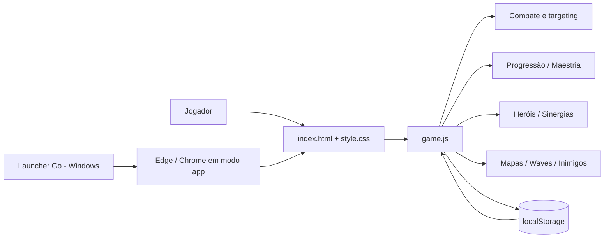

# 🐱 Catoons TD

[🇺🇸 English README](README_EN.md)

> **Tower Defense web/desktop desenvolvido de forma iterativa com JavaScript, HTML e CSS, usando IA como copiloto de engenharia.**

**Status:** Beta de portfólio · **Build:** v0.27.1  
**Plataformas:** Navegador moderno · Windows x64 via launcher local  
**Idioma atual:** Português (Brasil)

Catoons TD é um Tower Defense focado em **progressão, composição de equipes e leitura de combate**. O projeto começou como um protótipo simples e evoluiu para um jogo com mapas por tiers, dificuldades, caminhos de upgrade, heróis, maestria, unidades secretas, sinergias, inimigos especiais, poderes e modo infinito.

## 🎮 Jogar no navegador

O repositório foi organizado para funcionar diretamente no **GitHub Pages**. Depois de publicar o projeto, o `index.html` na raiz já é o ponto de entrada do jogo.

Para testar localmente, você pode abrir `index.html` em Edge/Chrome. Para uma experiência mais consistente, prefira servir a pasta com um servidor HTTP local.

## ✨ Destaques do projeto

- **13 mapas** organizados em 4 tiers: 6 Iniciantes, 4 Médios, 2 Difíceis e 1 Impossível.
- **3 dificuldades por mapa**: Fácil, Normal e Difícil.
- **13 gatinhos**, incluindo 3 personagens secretos descobertos apenas por conclusão completa de tiers.
- **Árvores de upgrade** com caminhos e crosspath limitado em unidades específicas.
- **Maestria até o nível 50**, com bônus permanentes, skin dourada e habilidade exclusiva no nível máximo.
- **4 Heróis Gatinhos**, com evolução do nível 1 ao 10 dentro de cada partida e habilidades/ultimates próprias.
- **8 sinergias** que alteram comportamento de combate quando combinações específicas estão em campo.
- **5 inimigos especiais** com habilidades próprias: Curandeiro, Atrapalhão, Bobo da Corte, Anjo e Demônio.
- **Economia e progressão persistente** com moedas, XP, estrelas, poderes consumíveis e saves locais.
- **Campanha e modo Infinito**.
- **Venda por 50% do investimento**, reposicionamento e estatísticas por torre.
- **Tutorial guiado**, configurações, exportação/importação de save e painel de playtest por `F8`.
- **Launcher Windows em Go**, sem embutir ou extrair o jogo: ele apenas abre a build local em modo app no Edge/Chrome.

## 🧠 Engenharia assistida por IA

A IA foi usada como **copiloto de desenvolvimento**, não como substituto da direção do projeto. O processo incluiu:

1. definição de requisitos e decisões de gameplay pelo autor;
2. decomposição das ideias em versões pequenas e testáveis;
3. geração/refatoração de código com assistência de IA;
4. testes manuais, identificação de bugs e ajustes de balanceamento;
5. revisão de UX, responsividade, persistência e distribuição;
6. documentação técnica e preparação para beta.

Esse fluxo demonstra capacidade de **transformar requisitos em software funcional, revisar o resultado gerado, depurar problemas e iterar sobre um produto real**.

Leia mais em [`docs/AI_ASSISTED_DEVELOPMENT.md`](docs/AI_ASSISTED_DEVELOPMENT.md).

## 🏗️ Arquitetura



A build atual é **client-side e offline-first**. Não há backend obrigatório: o estado persistente do jogador é armazenado em `localStorage`, com suporte a exportação/importação manual do save.

Mais detalhes: [`docs/ARCHITECTURE.md`](docs/ARCHITECTURE.md).

## 🧰 Tecnologias

| Tecnologia | Uso no projeto |
|---|---|
| HTML5 | Estrutura das telas e HUD |
| CSS3 | Interface, responsividade, animações e efeitos |
| JavaScript | Loop do jogo, combate, economia, progressão e persistência |
| Canvas 2D | Renderização do mapa, unidades, inimigos e efeitos |
| LocalStorage | Save local do jogador |
| Go | Launcher desktop Windows |
| Git / GitHub | Versionamento, documentação, Issues e Releases |
| GitHub Pages | Hospedagem da versão web do beta |

## 📁 Estrutura do repositório

```text
CatoonsTD/
├─ index.html
├─ src/
│  ├─ game.js
│  └─ style.css
├─ desktop/
│  └─ launcher.go
├─ docs/
│  ├─ ARCHITECTURE.md
│  ├─ AI_ASSISTED_DEVELOPMENT.md
│  ├─ BETA_TESTING.md
│  ├─ DEPLOY_GITHUB.md
│  └─ PORTFOLIO_TEXTS.md
├─ screenshots/
├─ .github/
│  └─ ISSUE_TEMPLATE/
├─ CHANGELOG.md
├─ CONTRIBUTING.md
├─ LICENSE
└─ README.md
```

## 🧪 Qualidade e testes

O repositório inclui uma workflow de CI em `.github/workflows/ci.yml` que valida a sintaxe do JavaScript e faz cross-build do launcher Windows a cada push/PR nas branches principais.

A build v0.27.x entrou em uma fase específica de **playtest e balanceamento**. O jogo possui um painel de diagnóstico acionado por `F8`, mostrando FPS, inimigos, projéteis, efeitos, torres, economia, HP de bosses, herói e sinergias ativas.

O checklist recomendado para o beta está em [`docs/BETA_TESTING.md`](docs/BETA_TESTING.md).

## 🚀 Como publicar no GitHub Pages

O projeto não precisa de build step. Após subir o repositório:

1. abra **Settings → Pages**;
2. selecione publicação a partir da branch principal;
3. escolha a pasta raiz `/`;
4. salve e aguarde o endereço do Pages ser criado.

Veja o passo a passo completo em [`docs/DEPLOY_GITHUB.md`](docs/DEPLOY_GITHUB.md).

## 🐞 Feedback do beta

Encontrou um problema? Use **Issues** e escolha o template **Bug report**. O template pede mapa, dificuldade, wave, herói, resolução e informações do painel F8 para facilitar a reprodução.

## 🗺️ Próximos passos antes do 1.0

- balanceamento completo das unidades e heróis;
- otimização de performance para ondas muito grandes;
- revisão de acessibilidade e configurações gráficas;
- sistema de backup automático de save;
- testes externos do beta e correções orientadas por feedback;
- assinatura/distribuição do executável Windows.

## 👨‍💻 Autor

**Luan Henrique Carvalho Pereira**  
Projeto desenvolvido para estudo, portfólio e evolução prática em Engenharia de Software, desenvolvimento de jogos web e uso responsável de IA no ciclo de desenvolvimento.

---

> Este repositório é uma versão de portfólio. Consulte [`LICENSE`](LICENSE) antes de reutilizar ou redistribuir o projeto.
