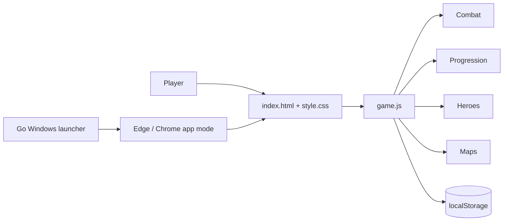

# 🐱 Catoons TD

[🇧🇷 README em Português](README.md)

> **Web/desktop Tower Defense built with HTML, CSS and JavaScript, using AI as an engineering copilot.**

**Status:** Portfolio Beta · **Build:** v0.27.2  
**Platforms:** Modern web browsers · Windows x64 through a lightweight Go launcher

Catoons TD is a personal software engineering project focused on **progression, team composition, combat readability and iterative product development**. It evolved from a small prototype into a game with map tiers, difficulty levels, upgrade paths, heroes, mastery, hidden units, synergies, special enemies, powers and an infinite mode.

## Highlights

- 13 maps across 4 progression tiers;
- 3 difficulty levels per map;
- 14 cat units, including 4 completely hidden unlocks, with the **Demon King Cat** tied to the Impossible tier;
- multi-path upgrade systems and limited crosspathing;
- Mastery progression up to level 50 with permanent bonuses, a golden skin and a unique active ability;
- 4 heroes that level from 1 to 10 during each match;
- 8 behavioral synergies between specific compositions;
- 5 special enemies with non-trivial mechanics;
- Campaign and Infinite modes;
- persistent local progression, save export/import and backward save migration;
- guided tutorial, responsive HUD and a developer playtest panel (`F8`);
- Go-based Windows launcher that opens the local web build in Edge/Chrome app mode.

## AI-assisted engineering

AI was used as a **development copilot**, not as an unchecked code generator. The project workflow was based on human-defined requirements, small versioned milestones, assisted implementation/refactoring, manual playtesting, bug reproduction, debugging and validation.

The project is meant to demonstrate the ability to **direct AI tools, verify their output, reason about software behavior and remain accountable for the final product**.

See [`docs/AI_ASSISTED_DEVELOPMENT.md`](docs/AI_ASSISTED_DEVELOPMENT.md) for the full explanation.

## Architecture

The current build is client-side and offline-first. No backend is required to run the game.

## Tech stack

- HTML5
- CSS3
- JavaScript
- Canvas 2D
- LocalStorage
- Go
- Git / GitHub
- GitHub Pages

## Repository purpose

This is the **portfolio-oriented source repository**. Windows binaries should be published through GitHub Releases rather than committed to Git history.

For deployment, architecture and testing details, read the documents under [`docs/`](docs/).

## Author

**Luan Henrique Carvalho Pereira**  
Personal project for software engineering practice, game development and responsible AI-assisted development.
