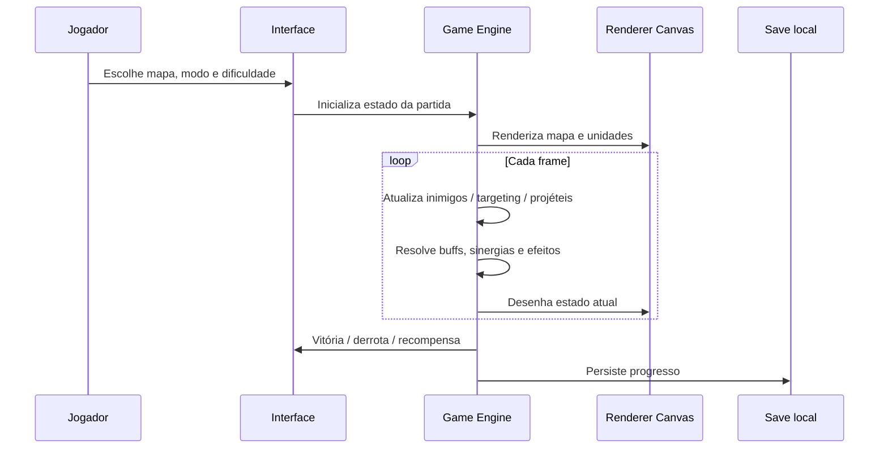

# Arquitetura — Catoons TD

## Visão geral

Catoons TD é uma aplicação de jogo **client-side**. A build web não exige servidor de aplicação, banco de dados ou API externa para executar.

### Camadas principais

1. **Interface (`index.html`)**
   - telas de Lobby, Play, Gatinhos, Heróis, Poderes e Tutorial;
   - HUD da partida;
   - modais de vitória/derrota/configurações;
   - elementos de acessibilidade e feedback visual.

2. **Apresentação (`src/style.css`)**
   - layout responsivo;
   - dock lateral durante a partida;
   - animações, estados de buff, sinergias e efeitos;
   - adaptação a telas menores e correções de viewport.

3. **Domínio e engine (`src/game.js`)**
   - catálogo de mapas, dificuldades, torres, heróis e poderes;
   - waves e spawning;
   - targeting e combate;
   - upgrades e crosspaths;
   - economia e recompensas;
   - maestria e progressão;
   - unidades secretas e condições de desbloqueio;
   - sinergias;
   - inimigos especiais;
   - renderização Canvas 2D;
   - persistência e migração de save.

4. **Persistência (`localStorage`)**
   - moedas permanentes;
   - nível/XP da conta;
   - progresso de mapas e estrelas;
   - recordes do modo infinito;
   - maestria individual;
   - inventário de poderes;
   - herói selecionado;
   - desbloqueios secretos;
   - configurações e estado do tutorial.

5. **Desktop (`desktop/launcher.go`)**
   - localiza `index.html` no pacote local;
   - procura Edge ou Chrome no Windows;
   - abre o jogo em modo app;
   - usa um perfil local específico para preservar o `localStorage` entre execuções;
   - não baixa, injeta, extrai ou embute os arquivos do jogo.

## Fluxo de uma partida



## Decisões de projeto

### Serverless / offline-first

Para o estágio atual, manter o jogo sem backend reduz complexidade de implantação e permite que a build seja hospedada no GitHub Pages. O custo é que o save fica associado ao navegador/perfil local, por isso existe exportação/importação manual.

### Estado centralizado da partida

A partida usa um estado central que concentra mapa, wave, dinheiro, vidas, torres, inimigos, efeitos, herói e métricas de playtest. Essa abordagem facilita sincronizar renderização e regras sem uma dependência externa de engine.

### Conteúdo orientado por dados

Mapas, torres, heróis, poderes e sinergias são descritos por objetos de configuração. Isso reduz duplicação e torna a expansão de conteúdo mais previsível.

### Migração de save

A aplicação reconhece chaves de versões antigas e normaliza o perfil para a estrutura atual. Isso permitiu evoluir o jogo sem apagar automaticamente o progresso de builds anteriores.

## Limitações conhecidas

- `game.js` ainda concentra responsabilidades demais e é candidato a modularização futura;
- o save local não possui sincronização em nuvem;
- a renderização Canvas 2D precisa de testes de performance com grandes quantidades de entidades;
- o launcher Windows ainda depende de Edge/Chrome instalado;
- o executável precisa de assinatura de código para distribuição pública mais profissional.

## Evolução arquitetural sugerida

Antes/depois do 1.0, uma refatoração segura poderia separar:

```text
src/
├─ core/
│  ├─ loop.js
│  ├─ state.js
│  └─ save.js
├─ combat/
│  ├─ targeting.js
│  ├─ projectiles.js
│  └─ effects.js
├─ content/
│  ├─ maps.js
│  ├─ towers.js
│  ├─ heroes.js
│  └─ enemies.js
├─ progression/
│  ├─ mastery.js
│  └─ rewards.js
└─ ui/
   ├─ lobby.js
   ├─ hud.js
   └─ settings.js
```

A prioridade antes do beta público é **estabilidade**, então essa refatoração deve ser gradual e coberta por playtests para evitar regressões.
